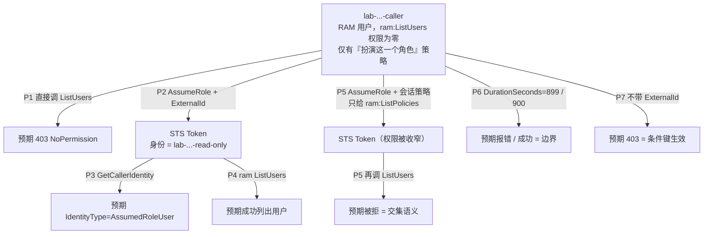

# aliyun-assume-role-lab

用 Terraform 在阿里云上搭一个**可复现、可拆除**的实验台，验证假设：

> **assume role 拿到的是「被扮演角色的权限」，不是「调用者权限的叠加」。**

实验体是一个刻意搭出来的冗余结构：一个**没有任何 `ram:ListUsers` 权限**的 RAM 用户，去扮演一个**有 `ram:ListUsers` 权限**的 RAM 角色，然后看这次只读调用能不能成功。生产上这层套通常是白套的（同账号直接给角色挂策略即可），这里套它只是为了**把变量隔离到「谁在调」这一个维度上**——同一个账号、同一个 API，唯一变化是调用者身份，实验结论因此可归因。

> **靶子为什么不是 ACR。** 最初的动机确实是「跨账号拉 ACR 镜像」，但 `cr:GetAuthorizationToken` 只对企业版实例生效，而 ACR 企业版实例只能包年包月，基础版 **¥564/月起**（`bssopenapi GetSubscriptionPrice` 实查，见第八节）。`ram:ListUsers` 免费、不需要任何真实资源，且「角色有 / 调用者没有 / 会话策略可收窄」三点与 ACR 完全同构。想换回 ACR 只需改两处，见 5.3。

> 这份文档为什么不在 `devops-okf` 里：知识库的「明确不做」裁定不收操作步骤类 Runbook，理由是步骤必须与它操作的资产同仓。这个实验台就是它的资产，所以文档跟着 repo 走。

## 一、这个实验能证明什么

| 能证明 | 不能证明 |
| --- | --- |
| 权限来自角色，调用者原有权限不参与计算 | 跨账号信任（同账号实验里没有账号边界） |
| Token 权限 = 角色策略 ∩ 会话策略（`Policy` 参数） | 条件键在生产配置里的完备性（只验了 `ExternalId` 一条） |
| `DurationSeconds` 的实际边界（899 报错 / 900 成功 / 角色 `MaxSessionDuration` 封顶） | 真实调用里的时钟漂移与续期窗口（手演一次不涉及） |
| 用响应里的 `AccessDeniedDetail` 区分「策略拒绝」与「参数错误」 | 网络轴（本实验是纯控制面调用，不涉及内网域名 / 白名单） |

## 二、实验设计



**P1 是整套实验的关键。** 没有这个阴性对照，P4 的成功无法排除「这个调用者本来就有权限」。先看见 403 的同一条命令，再看见它变成成功，才叫证据。

## 三、前置条件

| 需要 | 说明 |
| --- | --- |
| Terraform | `>= 1.5`（编写时本机 1.16.2） |
| 阿里云身份 | 能创建 RAM 用户 / 角色 / AccessKey，即 `ram:Create*` 一类权限 |
| aliyun CLI | 观测探针全部依赖它，安装见 3.1。为什么探针不写成 Terraform，见文末《附录：为什么探针用 CLI 而不是 Terraform》 |

### 3.1 aliyun CLI 的安装

本机是 Linux AMD64，官方给两条路：

```bash
# 路线 A：官方安装脚本（会放进 PATH）
/bin/bash -c "$(curl -fsSL https://aliyuncli.alicdn.com/install.sh)"

# 路线 B：手动放二进制
curl -LO https://aliyuncli.alicdn.com/aliyun-cli-linux-latest-amd64.tgz
tar -xzf aliyun-cli-linux-latest-amd64.tgz
sudo mv aliyun /usr/local/bin/aliyun

# 验证
aliyun version          # 本文档按 v3.5.0（2026-09-07）的文档核对
```

**不需要 `aliyun configure`。** 探针用 `ALIBABA_CLOUD_*` 环境变量传凭证，配合 `ALIBABA_CLOUD_IGNORE_PROFILE=TRUE` 绕开本机已有的 profile——省掉一层「现在到底在用谁的凭证」的歧义。

⚠️ **主账号不能调用 `AssumeRole`**（官方限制：该接口只能由 RAM 用户或 RAM 角色调用）。这与本实验的设计一致——调用者是 Terraform 建出来的 RAM 用户，不是主账号。所以请用主账号或带 RAM 管理权限的 RAM 身份去 `terraform apply`，但探针里的调用者始终是那个新建的 RAM 用户。

## 四、搭台

```bash
cd "$(ghq root)/github.com/zhaochunqi/aliyun-assume-role-lab"

terraform init
cp terraform.tfvars.example terraform.tfvars   # 填 region（其余用默认即可）
terraform plan
terraform apply
```

会创建这些对象（均带 `name_prefix` 前缀，便于辨认与清理）：

| 对象 | 作用 |
| --- | --- |
| `alicloud_ram_user` `${prefix}-caller` | **调用者**：靶子动作权限为零 |
| `alicloud_ram_access_key` 同名用户 | 调用者的长期 AK/SK（实验器材，用完必删） |
| `alicloud_ram_policy` `${prefix}-caller-assume` | 调用者侧策略：只允许扮演下面这一个角色 ARN |
| `alicloud_ram_role` `${prefix}-read-only` | **被扮演的角色**：信任策略钉到 `caller` 用户 ARN + `sts:ExternalId` 条件；`MaxSessionDuration=3600` |
| `alicloud_ram_policy` `${prefix}-role-read` | 角色侧策略：`ram:ListUsers` |
| 两个 `alicloud_ram_*_policy_attachment` | 把上面的策略分别挂到用户与角色 |

`terraform output` 会给出探针需要的全部值（AK/SK 标了 `sensitive`）。

⚠️ **state 里会有明文 SK**。这是实验器材的固有代价：本地 state、跑完就 `destroy`、不要把这个 repo 推到公共仓库、更不要 `terraform apply` 到生产账号的 state 后端。

## 五、跑探针

**首次尝试**：按 5.1 → 5.2 的顺序走（5.3 是可选）。**已经跑过一次、只是回来复跑**：`terraform apply` 之后 `./scripts/probe.sh` 一条命令。

### 5.1 确认 aliyun CLI 与凭证通路（首次先做这步）

CLI 若还没装，见 3.1。装好后先跑一条最简单的，确认 CLI 能读到凭证（这一步不通，后面全是假失败）：

```bash
export ALIBABA_CLOUD_IGNORE_PROFILE=TRUE
export ALIBABA_CLOUD_ACCESS_KEY_ID="$(terraform output -raw caller_access_key_id)"
export ALIBABA_CLOUD_ACCESS_KEY_SECRET="$(terraform output -raw caller_access_key_secret)"
unset ALIBABA_CLOUD_SECURITY_TOKEN

aliyun sts GetCallerIdentity --region cn-hangzhou
# 预期：IdentityType = RAMUser，Arn 形如 acs:ram::<账号ID>:user/<prefix>-caller
```

`ALIBABA_CLOUD_IGNORE_PROFILE=TRUE` 不能省——否则本机 `~/.aliyun/config.json` 里的默认 profile 可能覆盖掉你刚设的 AK，探针会在错误的身份上跑，结论直接作废。

### 5.2 逐条探针（预期输出即判据）

| # | 命令 | 预期 |
| --- | --- | --- |
| P1 | `aliyun ram ListUsers --region "$REGION"` | **403 `NoPermission`**——阴性对照成立 |
| P2 | `aliyun sts AssumeRole --RoleArn "$ROLE_ARN" --RoleSessionName "lab-$(date +%s)" --DurationSeconds 900 --ExternalId "$EXTERNAL_ID" --region "$REGION"` | 成功，返回 `Credentials.{AccessKeyId,AccessKeySecret,SecurityToken,Expiration}` 与 `AssumedRoleUser.Arn` |
| P3 | 用 P2 的 `Credentials` 三个值替换环境变量后：`aliyun sts GetCallerIdentity --region "$REGION"` | `IdentityType=AssumedRoleUser`、`RoleId` 非空、`Arn` 形如 `acs:ram::<账号ID>:role/<角色名>/<会话名>` |
| P4 | 沿用 P3 的会话凭证：`aliyun ram ListUsers --region "$REGION"` | **成功**：`IsTruncated=false` + `Users.User[]`。轮换：把这里的动作换成任一个「角色有、调用者没有」的 API（如 `cr:GetAuthorizationToken`）结论不变 |
| P5 | 重新 AssumeRole，本趟带 `--Policy '{"Version":"1","Statement":[{"Effect":"Allow","Action":["ram:ListPolicies"],"Resource":["*"]}]}'`，再用它调 `ListUsers` | **被拒**。角色允许 `ram:ListUsers`，但会话策略只给了一条其它动作 → 实际是交集，不是角色权限压倒一切 |
| P6 | `--DurationSeconds 899` → 报错；`--DurationSeconds 900` → 成功 | 边界：官方最小值 900 秒，最大值由角色 `MaxSessionDuration` 封顶（本实验 3600） |
| P7 | 与 P2 相同但**不带** `--ExternalId` | **403 `NoPermission`**——信任策略里的 `sts:ExternalId` 条件真的在拦人 |

脚本把上面 7 条串起来了（含 PASS/FAIL 汇总）：

```bash
./scripts/probe.sh
```

### 5.3 想换回 ACR 靶子

本实验默认用 `ram:ListUsers`，因为它免费且不需要真实资源。如果你的账号里已经有一个**企业版** ACR 实例（`cri-...`，个人版 `crpi-...` 不行），换回「跨账号拉镜像」的真实场景只要两步：

1. `main.tf` 的 `alicloud_ram_policy.role_read` 里把 `Action = ["ram:ListUsers"]` 改成 `["cr:GetAuthorizationToken"]`；
2. `scripts/probe.sh` 的 `probe_target()` 改成 `"$CLI" cr GetAuthorizationToken --InstanceId "<cri-...>" --ExpiresInHours 1 --region "$REGION"`，并把 P4 的成功判据从 `.Users` 换成 `.AuthorizationToken`。

判据：`GetAuthorizationToken` 只证明「能拿到凭证」。要证明「真能 pull」，用返回的 `TempUsername` / `AuthorizationToken` 做一次 `docker login` 再 `docker pull`，并注意**网络轴是正交的**：权限通了之后的失败不再是 403，而是超时或域名解析失败——内网拉取要同时解析**仓库域名、认证服务域名、镜像所在 OSS Bucket 域名**三个地址，只覆盖第一个会表现为「域名能解析但拉取超时」。

### 5.4 记录表（跑完填一张，作为实验证据）

| 探针 | 预期 | 实际 | 关键输出（错误码 / IdentityType / ExpireTime） |
| --- | --- | --- | --- |
| P1 | 403 | | |
| P2 | 成功 | | |
| P3 | `AssumedRoleUser` | | |
| P4 | 成功（列出用户） | | |
| P5 | 被拒 | | |
| P6 | 899 报错 / 900 成功 | | |
| P7 | 403 | | |

## 六、失败分诊

| 现象 | 大概在哪 |
| --- | --- |
| P2 就 403，文本是 `NoPermission ... specified role does not trust you` | 官方把两种原因合成了一个错误：调用者缺 `sts:AssumeRole`，**或**角色信任策略不含调用者。二分查：用户侧策略 / 角色信任策略 |
| P2 报 `Roles may not be assumed by root accounts` | 你用主账号在调。换成 RAM 用户 |
| P2 与 P7 报错完全一样，分不出带不带 ExternalId | 见第八节那条未验证点：同账号 / 具体用户 ARN 下条件键是否生效 |
| P3 的 `IdentityType` 仍是 `RAMUser` | 环境变量没替换成功（旧的 AK 还在？`SECURITY_TOKEN` 没设？profile 覆盖？） |
| P4 仍 403 但 P3 是 `AssumedRoleUser` | 权限轴：角色策略缺动作，或动作名写错（本实验应为 `ram:ListUsers`） |
| P4 报实例不存在（换回 ACR 靶子时） | `InstanceId` 与 `--region` 不匹配，或根本不是企业版实例 |
| P6 报 `InvalidParameter.DurationSeconds` | 低于 900 或高于角色 `MaxSessionDuration`（按预期，这就是判据） |
| 真拉取时超时而不是 403 | 网络轴：内网三域名 / 白名单 / VPC 打通，与权限无关 |

## 七、清理

```bash
terraform destroy
```

然后**人工确认**三件事（Terraform 管不到的部分）：

1. RAM 用户与它的 AccessKey 已被删除（`alicloud_ram_access_key` 删除后 SK 立即失效）
2. 角色、两条策略、两个授权关系都消失
3. 这个实验台留下的唯一实质风险是「一条可被利用的提权路径」。如果因为报错中途放弃，务必手工删掉那个 RAM 用户——**留着它，等于在账号里开了一条「谁拿到这把 AK 谁就能扮演一个只读角色（`ram:ListUsers`）」的通道**

## 八、备注与已知边界

靶子从 ACR 换成 `ram:ListUsers` 后，本实验在 2026-09-17 用 aliyun CLI v3.5.0、cn-hangzhou 实跑通过（8 PASS / 0 FAIL）。下面是把结论搬回生产时需要注意的几件事：

| 项目 | 说明 |
| --- | --- |
| `scripts/probe.sh` 实测情况 | 2026-09-17 在 cn-hangzhou、aliyun CLI v3.5.0 上实跑，8 PASS / 0 FAIL。命令、参数名、环境变量名此前按官方文档核对，错误码匹配用的是 `NoPermission` 等关键字，CLI 版本不同可能措辞略有差异 |
| ACR 企业版实例的价格 | `bssopenapi GetSubscriptionPrice` 实查：基础版 ¥564/月、标准版 ¥1390/月、高级版 ¥2456/月（大陆地域统一，香港 Basic ¥1141/月），且只有 `Subscription`（包年包月），没有按量实例。`cr:GetAuthorizationToken` 只对企业版实例生效，个人版 `crpi-...` 调它只会得到 `AUTHENTICATION_FAILED Unauthorized.` |
| `Principal.RAM` 写具体用户 ARN | 官方 `ExternalId` 示例用的是账号 root ARN；钉到具体 RAM 用户是控制台「指定 RAM 用户」的产物形态，本实验按此写法，实测 P2 成功、P7 被拒，条件键在同账号 + 具体用户 ARN 下确实生效 |
| 动作名随 CLI/产品版本变化 | 靶子动作 `ram:ListUsers` 已实测可用；换成其它产品（如 `cr:GetAuthorizationToken`）时，资源级授权与动作名以官方《使用 RAM 进行访问控制》为准 |

## 附录：为什么探针用 CLI 而不是 Terraform

搭台已经用了 Terraform，自然会问「探针能不能也写成 Terraform」。查了 provider 的实际能力后（alicloud 1.292.0），结论是**大部分能表达，但不该这么做**。

| 探针 | Terraform 能否表达 | 怎么表达 |
| --- | --- | --- |
| P1 阴性对照 | 能 | caller 的 AK 配 provider + `data.alicloud_ram_users`，它内部就调 `ListUsers`，失败是硬错误 |
| P2 扮演 | 能 | provider 的 `assume_role` 块 |
| P3 验身份 `IdentityType` | **不能** | provider 不暴露 `GetCallerIdentity` |
| P4 拿到 `ListUsers` 结果 | 能 | 同一个 data source 导出用户列表 |
| P4 里「会话临时凭证的 `Expiration`」 | **不能** | provider 不暴露 STS 的 `Expiration` |
| P5 交集语义 | 能 | `assume_role { policy = ... }` |
| P6 边界 899 / 900 | 能 | `session_expiration` 的合法区间正好是 [900, 43200] |
| P7 不带 ExternalId 应被拒 | 能 | `assume_role` 支持 `external_id`（v1.207.1+），省略即可 |

三笔代价：

1. **前提会被放宽**：`data.alicloud_ram_users` 之类的 data source 未必只调目标那一个动作（可能先调别的列举接口），角色策略就要多挂几个动作——「角色只有靶子权限」这个前提不再纯净，失败时也分不清挂在哪一层
2. **「预期失败」不是 Terraform 的原生概念**：P1 / P5 / P6 / P7 都是负向断言，用 Terraform 只能 plan + grep stderr + 人工判读，退出码不区分「该失败的失败」与「不该失败的失败」
3. **`assume_role` 是 provider 初始化期行为**：一个 root module 配不出「两种身份 × 两组参数」，每条探针要一份目录或一套 alias——约 4~5 份 root module 换 CLI 的 7 行命令

判据：Terraform 擅长「把状态变成目标」，而探针要的是「逐次调一个 API、看它返回什么、看它怎么失败」。**只想确认「这条路走得通」，Terraform-only 就够；想问「语义对不对」，就得让工具能逐次调用并保留错误码。**

## 参考

- [AssumeRole - 获取扮演角色的临时身份凭证](https://www.alibabacloud.com/help/zh/ram/developer-reference/api-sts-2015-04-01-assumerole) — 权限交集语义、`DurationSeconds` 边界、主账号不可调用、两种失败原因合并成一个错误
- [GetCallerIdentity - 获取当前调用者的身份信息](https://www.alibabacloud.com/help/zh/ram/developer-reference/api-sts-2015-04-01-getcalleridentity) — `IdentityType` 取值与 `RoleId`
- [ListUsers - 查询 RAM 用户列表](https://www.alibabacloud.com/help/zh/ram/developer-reference/api-ram-2015-05-01-listusers) — 本实验的靶子动作，免费、无需真实资源
- [GetAuthorizationToken - 获取用于登录实例的临时账号和临时密码](https://www.alibabacloud.com/help/zh/acr/developer-reference/api-cr-2018-12-01-getauthorizationtoken) — 原始靶子；只对企业版实例生效，`ExpiresInHours` 与 STS 有效期取小值
- [ACR 企业版计费](https://help.aliyun.com/zh/acr/product-overview/billing) — 实例只能包年包月，基础版 ¥564/月起（本仓库用 `bssopenapi` 实查）
- [使用 ExternalId 防止混淆代理人问题](https://www.alibabacloud.com/help/zh/ram/use-cases/use-externalid-to-prevent-the-confused-deputy-problem) — 信任策略里的 `sts:ExternalId` 条件写法
- [aliyun CLI 凭证配置](https://github.com/aliyun/aliyun-cli/blob/master/docs/en/configuration.md) — `ALIBABA_CLOUD_*` 环境变量与 `ALIBABA_CLOUD_IGNORE_PROFILE`
- 机制层背景（为什么这套东西在跨账号场景里才真正有价值）：`devops-okf` 的 [`RAM 与多账号`](https://github.com/zhaochunqi/devops-okf/blob/main/aliyun-devops/ram-and-multi-account.md) 与 [`跨账号获取 ACR 镜像`](https://github.com/zhaochunqi/devops-okf/blob/main/aliyun-devops/acr-cross-account.md)
