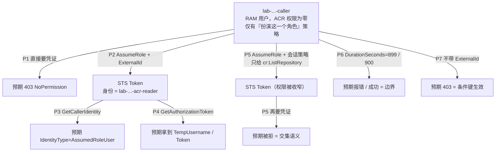

# aliyun-assume-role-lab

用 Terraform 在阿里云上搭一个**可复现、可拆除**的实验台，验证假设：

> **assume role 拿到的是「被扮演角色的权限」，不是「调用者权限的叠加」。**

实验体是一个刻意搭出来的冗余结构：一个**没有任何 ACR 权限**的 RAM 用户，去扮演一个**有 ACR 拉取权限**的 RAM 角色，然后看拉取凭证能不能拿到。生产上这层套通常是白套的（同账号直接给角色挂策略即可），这里套它只是为了**把变量隔离到「谁在调」这一个维度上**——同账号、同网络、同 ACR 实例，唯一变化是调用者身份，实验结论因此可归因。

> 这份文档为什么不在 `devops-okf` 里：知识库的「明确不做」裁定不收操作步骤类 Runbook，理由是步骤必须与它操作的资产同仓。这个实验台就是它的资产，所以文档跟着 repo 走。

## 一、这个实验能证明什么

| 能证明 | 不能证明 |
| --- | --- |
| 权限来自角色，调用者原有权限不参与计算 | 跨账号信任（同账号实验里没有账号边界） |
| Token 权限 = 角色策略 ∩ 会话策略（`Policy` 参数） | 条件键在生产配置里的完备性（只验了 `ExternalId` 一条） |
| `DurationSeconds` 与 `ExpireTime` 的实际对应关系 | 代码/流水线里的刷新与续期（手演一次不涉及） |
| 失败时「403 权限」与「超时网络」的分轴 | 网络轴（内网三域名解析，本实验默认走通的那条路） |

## 二、实验设计



**P1 是整套实验的关键。** 没有这个阴性对照，P4 的成功无法排除「这个调用者本来就有权限」。先看见 403 的同一条命令，再看见它变成成功，才叫证据。

## 三、前置条件

| 需要 | 说明 |
| --- | --- |
| Terraform | `>= 1.5`（编写时本机 1.16.2） |
| 阿里云身份 | 能创建 RAM 用户 / 角色 / AccessKey，即 `ram:Create*` 一类权限 |
| ACR 企业版实例 | 探针 P4 / P5 需要一个真实 `InstanceId`；P1 / P2 / P3 / P6 / P7 不需要 |
| aliyun CLI | 观测探针用。**编写时本机未安装**，见下方「已知的未验证点」 |

⚠️ **主账号不能调用 `AssumeRole`**（官方限制：该接口只能由 RAM 用户或 RAM 角色调用）。这与本实验的设计一致——调用者是 Terraform 建出来的 RAM 用户，不是主账号。所以请用主账号或带 RAM 管理权限的 RAM 身份去 `terraform apply`，但探针里的调用者始终是那个新建的 RAM 用户。

## 四、搭台

```bash
cd "$(ghq root)/github.com/zhaochunqi/aliyun-assume-role-lab"

terraform init
cp terraform.tfvars.example terraform.tfvars   # 填 acr_instance_id / region
terraform plan
terraform apply
```

会创建这些对象（均带 `name_prefix` 前缀，便于辨认与清理）：

| 对象 | 作用 |
| --- | --- |
| `alicloud_ram_user` `${prefix}-caller` | **调用者**：ACR 权限为零 |
| `alicloud_ram_access_key` 同名用户 | 调用者的长期 AK/SK（实验器材，用完必删） |
| `alicloud_ram_policy` `${prefix}-caller-assume` | 调用者侧策略：只允许扮演下面这一个角色 ARN |
| `alicloud_ram_role` `${prefix}-acr-reader` | **被扮演的角色**：信任策略钉到 `caller` 用户 ARN + `sts:ExternalId` 条件；`MaxSessionDuration=3600` |
| `alicloud_ram_policy` `${prefix}-acr-pull` | 角色侧策略：`cr:GetAuthorizationToken` + `cr:PullRepository` |
| 两个 `alicloud_ram_*_policy_attachment` | 把上面的策略分别挂到用户与角色 |

`terraform output` 会给出探针需要的全部值（AK/SK 标了 `sensitive`）。

⚠️ **state 里会有明文 SK**。这是实验器材的固有代价：本地 state、跑完就 `destroy`、不要把这个 repo 推到公共仓库、更不要 `terraform apply` 到生产账号的 state 后端。

## 五、跑探针

### 5.1 一次性：装 aliyun CLI 并确认凭证通路

装好后先跑一条最简单的，确认 CLI 能读到凭证（这一步不通，后面全是假失败）：

```bash
export ALIBABA_CLOUD_IGNORE_PROFILE=TRUE
export ALIBABA_CLOUD_ACCESS_KEY_ID="$(terraform output -raw caller_access_key_id)"
export ALIBABA_CLOUD_ACCESS_KEY_SECRET="$(terraform output -raw caller_access_key_secret)"
unset ALIBABA_CLOUD_SECURITY_TOKEN

aliyun sts GetCallerIdentity --region cn-hangzhou
# 预期：IdentityType = RAMUser，Arn 形如 acs:ram::<账号ID>:user/<prefix>-caller
```

`ALIBABA_CLOUD_IGNORE_PROFILE=TRUE` 不能省——否则本机 `~/.aliyun/config.json` 里的默认 profile 可能覆盖掉你刚设的 AK，探针会在错误的身份上跑，结论直接作废。

### 5.2 逐条探针（预期输出即判据）

| # | 命令 | 预期 |
| --- | --- | --- |
| P1 | `aliyun cr GetAuthorizationToken --InstanceId "$ACR" --ExpiresInHours 1 --region "$REGION"` | **403 `NoPermission`**——阴性对照成立 |
| P2 | `aliyun sts AssumeRole --RoleArn "$ROLE_ARN" --RoleSessionName "lab-$(date +%s)" --DurationSeconds 900 --ExternalId "$EXTERNAL_ID" --region "$REGION"` | 成功，返回 `Credentials.{AccessKeyId,AccessKeySecret,SecurityToken,Expiration}` 与 `AssumedRoleUser.Arn` |
| P3 | 用 P2 的 `Credentials` 三个值替换环境变量后：`aliyun sts GetCallerIdentity --region "$REGION"` | `IdentityType=AssumedRoleUser`、`RoleId` 非空、`Arn` 形如 `acs:ram::<账号ID>:role/<角色名>/<会话名>` |
| P4 | 沿用 P3 的会话凭证：`aliyun cr GetAuthorizationToken --InstanceId "$ACR" --ExpiresInHours 1 --region "$REGION"` | **成功**：`IsSuccess=true` + `TempUsername` / `AuthorizationToken` / `ExpireTime`。对比 `ExpireTime` 与 P2 的 `Credentials.Expiration`——取两者较小值 |
| P5 | 重新 AssumeRole，本趟带 `--Policy '{"Version":"1","Statement":[{"Effect":"Allow","Action":["cr:ListRepository"],"Resource":["*"]}]}'`，再用它调 `GetAuthorizationToken` | **被拒**。角色允许 `cr:*`，但会话策略只给了一条其它动作 → 实际是交集，不是角色权限压倒一切 |
| P6 | `--DurationSeconds 899` → 报错；`--DurationSeconds 900` → 成功 | 边界：官方最小值 900 秒，最大值由角色 `MaxSessionDuration` 封顶（本实验 3600） |
| P7 | 与 P2 相同但**不带** `--ExternalId` | **403 `NoPermission`**——信任策略里的 `sts:ExternalId` 条件真的在拦人 |

脚本把上面 7 条串起来了（含 PASS/FAIL 汇总）：

```bash
./scripts/probe.sh
```

### 5.3 想顺带看真拉取

`GetAuthorizationToken` 只证明「能拿到凭证」。要证明「真能 pull」，用返回的 `TempUsername` / `AuthorizationToken` 做一次 `docker login` 再 `docker pull`，并注意**网络轴是正交的**：权限通了之后的失败不再是 403，而是超时或域名解析失败——内网拉取要同时解析**仓库域名、认证服务域名、镜像所在 OSS Bucket 域名**三个地址，只覆盖第一个会表现为「域名能解析但拉取超时」。

### 5.4 记录表（跑完填一张，作为实验证据）

| 探针 | 预期 | 实际 | 关键输出（错误码 / IdentityType / ExpireTime） |
| --- | --- | --- | --- |
| P1 | 403 | | |
| P2 | 成功 | | |
| P3 | `AssumedRoleUser` | | |
| P4 | 成功 | | |
| P5 | 被拒 | | |
| P6 | 899 报错 / 900 成功 | | |
| P7 | 403 | | |

## 六、失败分诊

| 现象 | 大概在哪 |
| --- | --- |
| P2 就 403，文本是 `NoPermission ... specified role does not trust you` | 官方把两种原因合成了一个错误：调用者缺 `sts:AssumeRole`，**或**角色信任策略不含调用者。二分查：用户侧策略 / 角色信任策略 |
| P2 报 `Roles may not be assumed by root accounts` | 你用主账号在调。换成 RAM 用户 |
| P2 与 P7 报错完全一样，分不出带不带 ExternalId | 见第八节那条未验证点：同账号 / 具体用户 ARN 下条件键是否生效 |
| P3 的 `IdentityType` 仍是 `RAMUser` | 环境变量没替换成功（旧的 AK 还在？`SECURITY_TOKEN` 没设？profile 覆盖？） |
| P4 still 403 但 P3 是 `AssumedRoleUser` | 权限轴：角色策略缺动作，或动作名不对 |
| P4 报实例不存在 | `acr_instance_id` 与 `--region` 不匹配 |
| P6 报 `InvalidParameter.DurationSeconds` | 低于 900 或高于角色 `MaxSessionDuration`（按预期，这就是判据） |
| 真拉取时超时而不是 403 | 网络轴：内网三域名 / 白名单 / VPC 打通，与权限无关 |

## 七、清理

```bash
terraform destroy
```

然后**人工确认**三件事（Terraform 管不到的部分）：

1. RAM 用户与它的 AccessKey 已被删除（`alicloud_ram_access_key` 删除后 SK 立即失效）
2. 角色、两条策略、两个授权关系都消失
3. 这个实验台留下的唯一实质风险是「一条可被利用的提权路径」。如果因为报错中途放弃，务必手工删掉那个 RAM 用户——**留着它，等于在账号里开了一条「谁拿到这把 AK 谁就有 ACR 拉取权」的通道**

## 八、已知的未验证点

编写环境里**没有 aliyun CLI，也没有测试账号**，所以下面这些是按官方文档核对、但未实测的部分。首次运行时如果卡住，优先怀疑它们：

| 未验证点 | 说明 |
| --- | --- |
| `scripts/probe.sh` 未实测 | 命令、参数名、环境变量名均按官方文档核对；错误码匹配用的是 `NoPermission` 关键字，CLI 版本不同可能措辞略有差异 |
| `cr:PullRepository` 这个动作名 | `cr:GetAuthorizationToken` 已从 OpenAPI 元数据核实（资源类型为「全部资源」）；`cr:PullRepository` 是数据面动作，未在 OpenAPI 元数据里出现，若报权限不足请以官方《使用 RAM 进行访问控制》为准 |
| `Principal.RAM` 写具体用户 ARN | 官方 `ExternalId` 示例用的是账号 root ARN；钉到具体 RAM 用户是控制台「指定 RAM 用户」的产物形态，本实验按此写法 |
| 同账号 + 具体用户 ARN 时 `sts:ExternalId` 是否照常生效 | 官方 ExternalId 教程的场景是**跨账号**。如果 P2 报 403 而 P7 报错文本与它一模一样（分不出有无 ExternalId 的差别），先怀疑这一条：临时去掉信任策略里的 `Condition` 复跑 P2 |
| ACR 拉取本身 | 未包含在内（需要真实实例与网络通路） |

## 参考

- [AssumeRole - 获取扮演角色的临时身份凭证](https://www.alibabacloud.com/help/zh/ram/developer-reference/api-sts-2015-04-01-assumerole) — 权限交集语义、`DurationSeconds` 边界、主账号不可调用、两种失败原因合并成一个错误
- [GetCallerIdentity - 获取当前调用者的身份信息](https://www.alibabacloud.com/help/zh/ram/developer-reference/api-sts-2015-04-01-getcalleridentity) — `IdentityType` 取值与 `RoleId`
- [GetAuthorizationToken - 获取用于登录实例的临时账号和临时密码](https://www.alibabacloud.com/help/zh/acr/developer-reference/api-cr-2018-12-01-getauthorizationtoken) — `ExpiresInHours` 与 STS 有效期取小值
- [使用 ExternalId 防止混淆代理人问题](https://www.alibabacloud.com/help/zh/ram/use-cases/use-externalid-to-prevent-the-confused-deputy-problem) — 信任策略里的 `sts:ExternalId` 条件写法
- [aliyun CLI 凭证配置](https://github.com/aliyun/aliyun-cli/blob/master/docs/en/configuration.md) — `ALIBABA_CLOUD_*` 环境变量与 `ALIBABA_CLOUD_IGNORE_PROFILE`
- 机制层背景（为什么这套东西在跨账号场景里才真正有价值）：`devops-okf` 的 [`RAM 与多账号`](https://github.com/zhaochunqi/devops-okf/blob/main/aliyun-devops/ram-and-multi-account.md) 与 [`跨账号获取 ACR 镜像`](https://github.com/zhaochunqi/devops-okf/blob/main/aliyun-devops/acr-cross-account.md)
